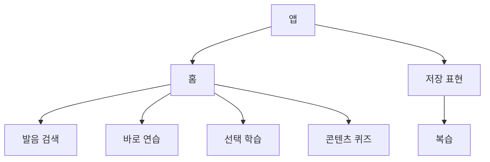
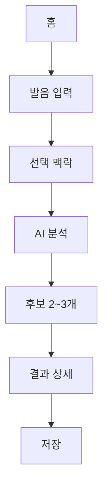
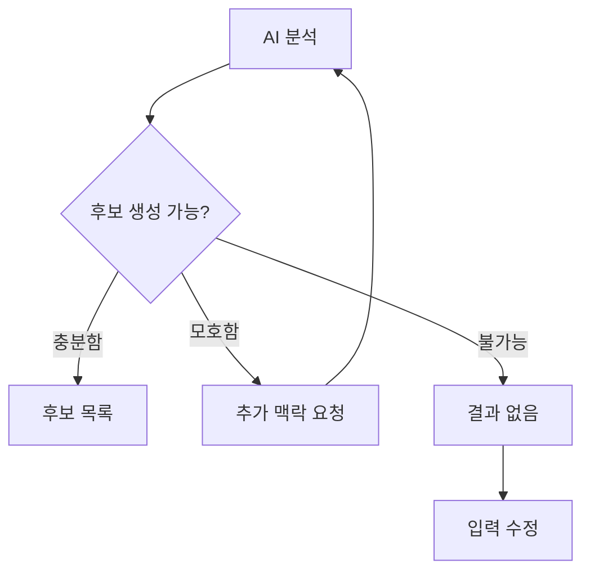
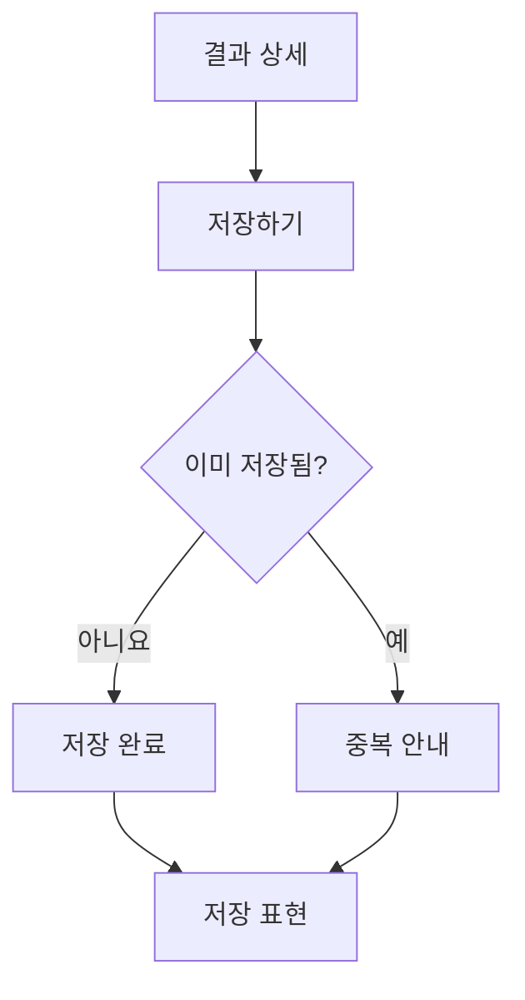
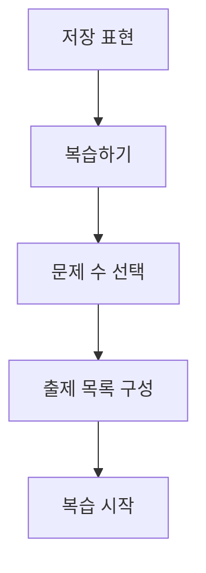
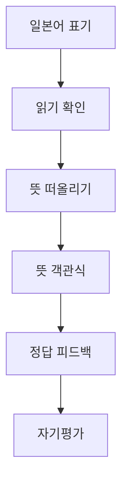

# Information Architecture & User Flow

> Status: V1 structure defined  
> Scope: HEARD + PRACTICE + COMPARE + SAVE + OPTIONAL REVIEW

## 1. IA Goal

V1 홈은 검색 도구와 학습 콘텐츠 허브의 역할을 함께 합니다.

1. 기억한 일본어 소리를 찾는다.
2. 무작위 단어·문장으로 바로 연습한다.
3. 히라가나·가타카나·한자를 선택해 학습한다.
4. J-POP 제목 퀴즈·상황 대화·소복이네 그림으로 연습한다.
5. 저장한 표현을 원할 때 다시 학습한다.

전역 내비게이션은 **홈**과 **저장 표현**으로 유지합니다. 무작위 연습·선택 학습·콘텐츠 퀴즈는 홈의 학습 섹션에서 진입하고, 복습은 저장 표현 안의 **복습하기**로 연결합니다.

## 2. Primary Navigation

### Global Navigation

- **홈** — 발음 검색·무작위 연습·선택 학습·콘텐츠 퀴즈의 시작점
- **저장 표현** — 저장 목록·표현 상세·복습 진입

V1에서 제외:

- 별도 복습 탭
- 프로필
- 설정
- 랭킹·스트릭
- 독립적인 WRITE·READ·LISTEN 탭
- 결제·계정

모바일에서는 2개 항목의 하단 내비게이션, 데스크톱에서는 헤더 내비게이션을 기본 가설로 둡니다. 구체적인 배치는 Wireframe 단계에서 검증합니다.

## 3. Sitemap



### Home

우선순위 순으로 대표 카드와 더보기를 제공합니다.

1. 발음 검색
2. 바로 연습하기 — 무작위 단어·문장
3. 이어서 학습하기 — 저장·복습
4. 선택 학습 — 히라가나·가타카나·한자
5. 콘텐츠로 연습하기 — J-POP 제목 퀴즈·상황 대화
6. 소복이네 그림 퀴즈

발음 검색 안에는 선택 맥락·분석·후보·낮은 확신·결과 없음·오류 흐름이 포함됩니다.

### Candidate Selection

- 입력한 한글 발음
- 선택 맥락 요약
- 일본어 후보 2~3개
- 후보별 표기·히라가나·한 줄 의미
- 후보 간 핵심 차이
- 찾던 표현 없음
- 맥락 추가

### Result Detail

- 일본어 표기
- 읽기·뜻 펼치기
- 영문 로마자 발음
- 핵심 단어·활용
- 유사 후보 비교
- 예상 의미와 실제 의미
- 상세 문법
- 저장
- 찾던 표현 여부 피드백
- 새 표현 찾기

### Saved Expressions

- 저장 표현 목록
- 최근 저장 순 정렬
- 전체 / 헷갈려요 필터
- 표현 상세
- 복습하기
- Empty State

### Review

- 문제 수 선택
- 표기 읽기
- 읽기 확인
- 발음 힌트
- 뜻 떠올리기
- 뜻 객관식
- 정답·오답 피드백
- 알았어요 / 헷갈려요
- 세션 완료
- 중도 종료

## 4. Screen Inventory

| ID | Screen | Main purpose | Primary action |
|---|---|---|---|
| H-01 | Home / Initial | 검색 시작 | 분석하기 |
| H-02 | Home / Context Open | 선택 맥락 입력 | 입력 완료 |
| H-03 | Loading | AI 분석 상태 전달 | 취소 |
| P-01 | Quick Practice | 무작위 단어·문장 연습 | 문제 시작 |
| P-02 | Practice Feedback | 정답·읽기·뜻 확인 | 저장 또는 다음 |
| L-01 | Script Select | 히라가나·가타카나·한자 선택 | 학습 시작 |
| L-02 | Script Table | 문자표·읽기 확인 | 퀴즈 풀기 |
| Q-01 | Content Select | J-POP 제목 퀴즈·상황 대화 선택 | 콘텐츠 시작 |
| Q-02 | J-POP Title Quiz | 곡 제목의 뜻 선택 | 답 선택 |
| Q-03 | Title Feedback | 읽기·뜻·표현·출처 확인 | 저장 또는 다음 |
| Q-04 | Situation Quiz | 문장·상황·뜻 문제 | 답 선택 |
| I-01 | Picture Quiz | 그림과 맞는 표현 판단 | 답 선택 |
| C-01 | Candidate List | 찾던 표현 선택 | 이 표현이에요 |
| C-02 | Need More Context | 모호한 입력 보완 | 맥락 추가 |
| C-03 | No Result | 검색 실패 회복 | 다시 입력 |
| R-01 | Result / Collapsed | 일본어 표기 먼저 확인 | 읽기·뜻 보기 |
| R-02 | Result / Expanded | 뜻·읽기·핵심 구조 이해 | 저장하기 |
| R-03 | Result / Compare | 후보·오해 원인 비교 | 상세 문법 보기 |
| S-01 | Saved List | 저장 표현 탐색 | 표현 보기 |
| S-02 | Saved Empty | 저장 전 안내 | 표현 찾으러 가기 |
| S-03 | Saved Detail | 저장 표현 재확인 | 복습 또는 삭제 |
| V-01 | Review Setup | 문제 수 선택 | 복습 시작 |
| V-02 | Review / Read | 표기 읽기 시도 | 읽기 확인 |
| V-03 | Review / Recall | 뜻 떠올리기 | 뜻 확인하기 |
| V-04 | Review / Choice | 의미 객관식 | 답 선택 |
| V-05 | Review / Feedback | 정답·핵심 차이 확인 | 자기평가 |
| V-06 | Review Complete | 세션 결과 요약 | 저장 표현으로 |
| X-01 | Error | 일시 오류에서 회복 | 다시 시도 |

## 5. Core Search Flow



### Step 1 — Home

기본 화면에는 한글 발음 입력을 가장 먼저 배치합니다.

필수:

- 한글 발음

선택 영역:

- 들은 곳
- 상황
- 앞뒤 단어
- 예상 의미

선택 영역은 접힌 상태로 시작하며 검색을 막지 않습니다.

### Step 2 — Loading

- 입력한 발음을 유지합니다.
- 현재 분석 중임을 보여줍니다.
- 긴 로딩 문구나 과장된 AI 표현을 사용하지 않습니다.
- 취소하면 입력값이 남은 홈으로 돌아갑니다.

### Step 3 — Candidate Selection

후보가 하나뿐이어도 자동으로 정답 처리하지 않습니다. “이 표현인가요?” 확인 단계를 거칩니다.

후보 카드:

- 일본어 표기
- 히라가나
- 한 줄 의미
- 상황 적합성 또는 다른 후보와의 차이
- 정성적 상태: 가능성 높음 / 맥락 필요

숫자 형태의 AI 확률은 사용하지 않습니다.

### Step 4 — Result

첫 상태에는 일본어 표기만 가장 강하게 보여줍니다.

사용자 행동 순서:

1. 일본어 표기 확인
2. 읽기·뜻 펼치기
3. 필요하면 영문 로마자 발음
4. 핵심 단어·활용 확인
5. 후보 차이·오해 원인 확인
6. 상세 문법 펼치기
7. 저장 또는 새 검색

## 6. Ambiguity & Failure Flow



### Low Confidence

다음 상황에서는 정답처럼 단정하지 않습니다.

- 입력이 너무 짧음
- 여러 일본어 표현이 동일하게 들림
- 발음 누락이 큼
- 상황과 후보가 충돌함

제공 행동:

- 상황 선택
- 앞뒤 단어 추가
- 예상 의미 추가
- 입력 수정
- 그래도 검색

### No Result

- “일본어가 아닙니다”처럼 단정하지 않습니다.
- 기억나는 부분만 다시 입력할 수 있게 합니다.
- 예시를 보여주되 사용자의 입력을 삭제하지 않습니다.
- 새 검색과 맥락 추가를 모두 제공합니다.

### Technical Error

- 입력값을 보존합니다.
- 다시 시도와 홈으로 돌아가기를 제공합니다.
- 저장 실패 시 결과 화면은 유지합니다.

## 7. Save Flow



### Save Rules

- 동일한 일본어 표기와 의미 조합은 중복 저장하지 않습니다.
- 이미 저장한 표현이면 “저장됨” 상태를 유지합니다.
- 저장 후 즉시 복습을 요구하지 않습니다.
- 저장 완료 뒤 현재 결과를 계속 볼 수 있습니다.
- 저장 목록에서는 최근 저장 표현을 먼저 보여줍니다.

## 8. Saved Expressions Structure

### List Card

- 일본어 표기
- 마지막 상태: 미복습 / 알았어요 / 헷갈려요
- 저장한 상황 또는 출처
- 저장일

뜻은 목록에서 항상 펼쳐두지 않습니다. 표현 상세의 히라가나 옆 `(발음 보기)`를 누르면 영문 로마자 발음을 확인합니다.

### Filters

V1 필터:

- 전체
- 헷갈려요

검색·태그·상세 정렬은 사용 사례가 쌓인 뒤 확장합니다.

### Empty State

- 아직 저장한 표현이 없다는 사실
- 저장하면 무엇을 할 수 있는지
- ‘표현 찾으러 가기’ 버튼

소복이네 캐릭터는 안내를 돕되 정보보다 크게 보이지 않게 합니다.

## 9. Review Setup Flow



### Count Selection

- 1부터 현재 저장 개수까지 직접 선택
- 0개는 시작 불가
- 저장 개수를 초과할 수 없음
- 선택한 개수와 예상 진행량 표시
- 저장 표현이 없으면 복습하기 비활성화

### Selection Logic

1. ‘헷갈려요’ 표현을 우선 포함
2. 남은 자리를 전체 저장 표현에서 무작위로 선택
3. 헷갈린 표현이 선택 개수보다 많으면 그중 무작위 선택
4. 같은 세션에서 동일 표현 중복 없음

## 10. One-expression Review Flow



### Read

- 일본어 표기만 먼저 표시
- ‘읽기 확인’으로 히라가나 공개
- 히라가나 옆의 작은 `(발음 보기)` 버튼으로 영문 로마자 발음 공개
- 뜻은 아직 숨김

### Recall & Choice

- 뜻을 머릿속으로 떠올릴 시간을 줍니다.
- ‘뜻 확인하기’를 누르면 객관식이 나옵니다.
- 선택 전에는 정답 의미를 공개하지 않습니다.

### Feedback

정답:

- 정답 상태
- 핵심 의미
- 상세 문법 펼치기

오답:

- 선택한 답과 정답 비교
- 의미를 갈라놓은 핵심 차이
- 상세 문법 펼치기
- 강제 재도전 없음

### Self-rating

- 알았어요
- 헷갈려요

선택하면 다음 표현으로 이동합니다. ‘헷갈려요’는 다음 세션의 우선 출제 신호가 됩니다.

## 11. Review Exit & Completion

### Mid-session Exit

복습 중 닫기 또는 뒤로 가기를 선택하면:

- “복습을 그만할까요?” 확인
- **계속하기**
- **그만하기**

그만하기를 선택해도 완료한 문제의 결과는 저장합니다. 미완료 문제는 기록하지 않습니다.

### Completion

표시 정보:

- 완료한 표현 수
- 알았어요 수
- 헷갈려요 수
- 영문 로마자 발음을 확인한 표현 수

제공 행동:

- 저장 표현으로 돌아가기
- 새 표현 찾기
- 헷갈린 표현만 다시 보기 — 선택 사항이며 강제하지 않음

축하 표현은 사용하되 스트릭·감점·압박 문구는 사용하지 않습니다.

## 12. State Inventory

### Search

- Initial
- Typing
- Optional Context Open
- Loading
- Multiple Candidates
- Single Candidate Confirmation
- Low Confidence
- Need More Context
- No Result
- Error

### Result & Save

- Result Collapsed
- Result Expanded
- Pronunciation Hint Open
- Grammar Open
- Unsaved
- Saving
- Saved
- Save Error
- Already Saved

### Saved

- Empty
- List
- Filtered
- No Filter Result
- Expression Detail

### Review

- Setup
- Read
- Reading Open
- Romanization Open
- Recall Prompt
- Multiple Choice
- Correct
- Incorrect
- Self-rating
- Exit Confirm
- Complete

## 13. Data Objects

### Expression

- id
- japanese
- kana
- romanization
- meaning
- source
- context
- originalSoundInput
- expectedMeaning
- gapExplanation
- keyWords
- grammar
- similarCandidates
- createdAt

### Learning Record

- expressionId
- savedAt
- lastReviewedAt
- reviewCount
- meaningChoiceCorrect
- pronunciationHintOpened
- lastSelfRating
- confusedPriority

V1은 LocalStorage를 사용하며 계정·동기화는 포함하지 않습니다.

## 14. UX Guardrails

- 검색 입력과 선택 맥락은 뒤로 가도 보존합니다.
- 후보가 하나여도 사용자가 확인합니다.
- 낮은 확신을 숫자 확률로 위장하지 않습니다.
- 읽기와 뜻을 한꺼번에 자동 공개하지 않습니다.
- 영문 로마자 발음은 히라가나 옆의 작은 `(발음 보기)` 버튼을 누른 뒤에만 보여줍니다.
- 저장 후 복습을 강제하지 않습니다.
- 오답 뒤 재도전을 강제하지 않습니다.
- 복습 종료를 막지 않습니다.
- 완료 문제의 기록만 저장합니다.
- 저장 표현 삭제는 확인 후 수행합니다.

## 15. V1 Routes — Working Draft

| Route | Screen |
|---|---|
| / | Home / Search |
| /candidates | Candidate Selection |
| /result/:id | Result Detail |
| /saved | Saved Expressions |
| /saved/:id | Saved Detail |
| /review | Review Setup |
| /review/session | Review Session |
| /review/complete | Review Complete |
| /practice | Random Word / Sentence Practice |
| /learn/:script | Hiragana / Katakana / Kanji |
| /content | J-POP Title Quiz / Situation Dialogue |
| /picture-quiz | Sobokine Picture Quiz |

실제 구현 시 라우트는 프레임워크와 상태 관리 방식에 따라 조정할 수 있습니다.

## 16. Next — Low-fi Wireframe

다음 단계에서는 아래 화면을 실제 레이아웃으로 검증합니다.

1. Home Content Hub
2. Home / Search + Optional Context
3. Candidate List
4. Result Collapsed / Expanded
5. Quick Practice / Feedback
6. Script Select / Table / Quiz
7. Content Select / J-POP Title / Situation Quiz
8. Picture Quiz
9. Saved List / Empty
10. Review Setup / Read / Choice / Feedback / Complete
11. Low Confidence / No Result / Error


## 17. Home Learning Modules

### Quick Practice

- 무작위 단어
- 무작위 짧은 문장
- 히라가나·가타카나·한자가 섞인 실제 표기
- 읽기→뜻 떠올리기→뜻 고르기→피드백
- 유용한 표현 저장

### Select Learning

- 히라가나 표·행별 연습·읽기 퀴즈
- 가타카나 표·유사 글자 비교·외래어 퀴즈
- 자주 쓰는 한자 표현·읽기·문장 속 인식
- 최초 20개 노출 후 표 하단의 `더 많은 한자 표현 보기`로 다음 20개 추가

### Content Practice

- 실제 J-POP의 곡 제목 텍스트를 보고 한국어 뜻 고르기
- 정답 뒤 히라가나·선택형 영문 로마자·핵심 단어·문법 확인
- 곡명·가수명·출처를 일반 텍스트로 표시
- 가사·음원·앨범아트·로고·영상 이미지는 V1에서 제외
- 식당·호텔·지하철·일상 대화 등 자체 상황 콘텐츠
- 문장·상황에 맞는 뜻 고르기

### Picture Quiz

- 소복이네 그림→단어 고르기
- 상황 그림→문장 고르기
- 캐릭터 대사와 상황이 맞는지 O/X
- 정답 뒤 읽기·뜻·상황 설명

세부 제작 수량과 권리 기준은 [CONTENT-PLAN.md](./CONTENT-PLAN.md)를 따릅니다.


### Kanji Table Expansion

```text
한자 표현 표 20개
→ 더 많은 한자 표현 보기
→ 동일 표에 다음 20개 추가
→ 총 40개 / 버튼 숨김
```

- View more는 표 바로 아래의 보조 텍스트 버튼입니다.
- 기존 항목을 교체하거나 별도 페이지로 이동하지 않습니다.
- 추가 로딩 후 사용자의 현재 스크롤 위치를 유지합니다.
- 로딩 중에는 버튼 자리에 짧은 진행 상태를 표시하고 중복 클릭을 막습니다.
- 불러오기에 실패하면 기존 20개를 유지하고 버튼 아래에 다시 시도를 제공합니다.


## 18. J-POP Title Quiz Flow

```text
일본어 곡 제목
→ 뜻 객관식
→ 정답
→ 히라가나 읽기
→ 선택형 로마자 발음
→ 핵심 단어·문법
→ 곡명·가수명·출처
→ 저장 또는 다음 문제
```

- 문제 상태에서는 제목 텍스트만 크게 보여줍니다.
- 곡이나 가수의 인지도보다 일본어 표현 자체로 답하게 합니다.
- 가수명은 정답 피드백에서 출처 정보로 보여줍니다.
- 오답 선택지는 제목의 단어·조사·활용을 실제로 혼동할 만한 의미로 구성합니다.
- 실제 가사 한 줄, 음원 미리듣기, 앨범아트와 공식 로고는 포함하지 않습니다.
