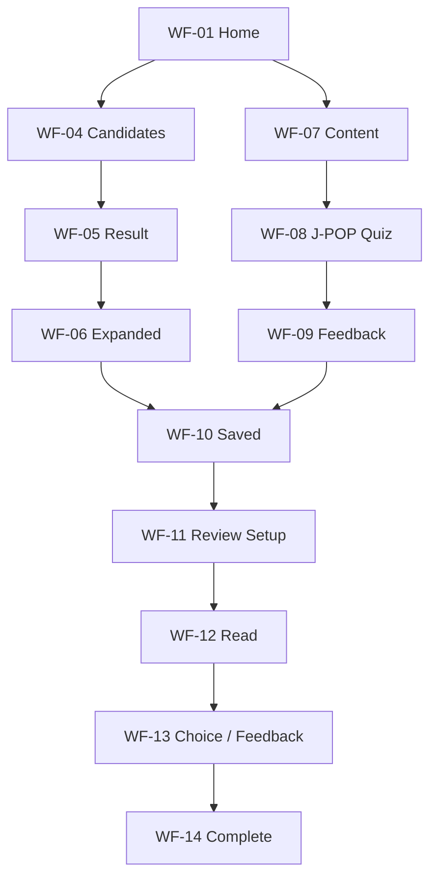

# Low-fi Wireframe — Round 1

> Status: 구조 설계 완료 · 실제 프레임 제작 전  
> Platform: Mobile first  
> Baseline frame: 390 × 844  
> Scope: Search + J-POP Title Quiz + Save + Minimal Review

## 1. Goal

1차 Low-fi는 모든 기능을 한 번에 그리는 단계가 아니라, 제품의 핵심 학습 루프가 한 화면 흐름으로 성립하는지 검증합니다.

```text
들은 발음 찾기
→ 후보 비교
→ 표기·읽기·뜻 이해
→ 저장
→ 콘텐츠 문제 풀기
→ 원할 때 복습
```

검증 질문:

- 홈에서 핵심 기능인 발음 검색이 가장 먼저 보이는가?
- 검색과 학습 콘텐츠가 서로 경쟁하지 않고 자연스럽게 구분되는가?
- 일본어 표기 → 읽기 → 뜻의 공개 순서가 유지되는가?
- J-POP 퀴즈가 음악 지식이 아니라 일본어 학습 문제로 보이는가?
- 저장과 다음 문제 중 어느 행동도 과도하게 강요되지 않는가?
- 복습에서 영문 로마자 발음이 기본 힌트처럼 노출되지 않는가?

## 2. Frame Rules

| Item | Rule |
|---|---|
| Canvas | 390 × 844 |
| Content width | 좌우 20px 여백 |
| Header | 56px |
| Bottom navigation | 64px + Safe area |
| Primary button | 화면당 원칙적으로 1개 |
| Tap target | 최소 44 × 44px |
| Japanese title | 화면의 첫 시각적 초점 |
| Reading | 사용자 행동 뒤 공개 |
| Romanization | 히라가나 옆 작은 `발음 보기`로 공개 |
| Meaning | 문제·회상 단계 전에는 숨김 |
| Character | 소복이네는 안내·빈 상태·상황 전달에만 사용 |
| Assets | 앨범아트·가사·음원·공식 로고 사용 금지 |

## 3. Round 1 Frame Set

| Order | ID | Frame | Validation purpose |
|---:|---|---|---|
| 1 | WF-01 | Home / Initial | 검색과 학습 허브의 우선순위 |
| 2 | WF-02 | Home / Context Open | 선택 맥락의 입력 부담 |
| 3 | WF-03 | Search / Loading | 입력 보존과 진행 상태 |
| 4 | WF-04 | Candidate List | 2~3개 후보 비교 |
| 5 | WF-05 | Result / Collapsed | 표기 우선 노출 |
| 6 | WF-06 | Result / Expanded | 읽기·뜻·문법의 정보량 |
| 7 | WF-07 | Content Select | J-POP과 자체 상황 콘텐츠 진입 |
| 8 | WF-08 | J-POP Quiz | 제목 의미 객관식 |
| 9 | WF-09 | J-POP Feedback | 읽기·뜻·해설·출처 |
| 10 | WF-10 | Saved List | 저장 표현 탐색과 복습 진입 |
| 11 | WF-11 | Review Setup | 문제 수 선택 |
| 12 | WF-12 | Review / Read | 표기 읽기와 선택형 발음 힌트 |
| 13 | WF-13 | Review / Choice + Feedback | 뜻 선택·차이 이해·자기평가 |
| 14 | WF-14 | Review Complete | 결과 확인과 다음 행동 |

## 4. Global Structure

### Header

- 좌측: 서비스 워드마크 또는 화면 제목
- 우측: 화면에 필요한 단일 보조 행동만 배치
- V1에는 프로필·설정·알림 아이콘을 두지 않음

### Bottom Navigation

| Tab | Destination | State |
|---|---|---|
| 홈 | WF-01 | 기본 활성 |
| 저장 표현 | WF-10 | 저장 개수 배지 선택 사항 |

퀴즈·결과·복습 세션에서는 하단 내비게이션을 숨겨 문제 집중도를 유지합니다. 종료는 상단의 닫기 또는 뒤로 가기로 제공합니다.

## 5. Screen Layouts

### WF-01 — Home / Initial

| Vertical order | Component | Content / behavior |
|---:|---|---|
| 1 | Header | 워드마크 |
| 2 | Search title | 들은 일본어, 어떻게 쓰는지 찾아볼까요? |
| 3 | Pronunciation input | 한글로 들린 발음 입력 |
| 4 | Optional context | `들은 상황도 알려주기` 접힘 영역 |
| 5 | Primary CTA | 분석하기 |
| 6 | Quick practice | 무작위 단어 / 짧은 문장 대표 카드 |
| 7 | Continue | 저장 표현 수와 복습하기 |
| 8 | Select learning | 히라가나 / 가타카나 / 한자 |
| 9 | Content practice | J-POP 제목 / 상황 대화 |
| 10 | Picture quiz | 소복이네 그림 퀴즈 |
| 11 | Bottom nav | 홈 활성 |

홈에서 모든 카드를 같은 크기로 만들지 않습니다. 검색 영역이 가장 크고, 바로 연습·이어서 학습은 중간 크기, 나머지는 묶음 카드로 축소합니다.

### WF-02 — Home / Context Open

| Area | Fields |
|---|---|
| 기존 입력 | 한글 발음 유지 |
| 들은 곳 | 노래 / 애니 / 대화 / 여행 / 기타 |
| 앞뒤 단어 | 선택 입력 |
| 예상 의미 | 선택 입력 |
| Actions | 입력 완료 / 접기 |

선택 맥락을 열어도 `분석하기`가 화면 아래로 지나치게 밀리지 않도록 필드 수와 높이를 제한합니다.

### WF-03 — Search / Loading

- 사용자가 입력한 한글 발음을 그대로 표시
- 짧은 진행 문구: `비슷하게 들리는 표현을 찾고 있어요`
- 취소 시 WF-01로 돌아가며 입력값 유지
- 가짜 퍼센트와 과장된 AI 문구 사용 금지

### WF-04 — Candidate List

| Area | Content |
|---|---|
| Header | 뒤로 / 어떤 표현을 찾으셨나요? |
| Input summary | 한글 발음 + 선택 맥락 |
| Candidate card × 2~3 | 일본어 표기, 히라가나, 한 줄 뜻, 차이 |
| Confidence label | 가능성 높음 / 맥락이 더 필요해요 |
| Recovery | 찾던 표현이 없어요 |
| Optional action | 맥락 추가하기 |

숫자 확률은 표시하지 않습니다. 카드 전체가 선택 영역이며 선택 후에도 결과를 정답처럼 단정하지 않습니다.

### WF-05 — Result / Collapsed

| Vertical order | Component |
|---:|---|
| 1 | Header | 뒤로 / 결과 |
| 2 | Context label | 노래에서 들은 표현 |
| 3 | Japanese expression | 가장 크게 표시 |
| 4 | Primary reveal | 읽기와 뜻 보기 |
| 5 | Compare preview | 비슷하게 들린 표현 |
| 6 | Save | 저장하기 |
| 7 | Feedback | 찾던 표현이에요 / 아니에요 |

첫 화면에는 히라가나·뜻·로마자를 자동으로 노출하지 않습니다.

### WF-06 — Result / Expanded

| Area | Content |
|---|---|
| Expression | 일본어 표기 |
| Reading | 히라가나 + 작은 `발음 보기` |
| Meaning | 자연스러운 한국어 뜻 |
| Key structure | 핵심 단어·원형·활용 |
| Compare | 유사 후보와 의미를 가른 차이 |
| Grammar | 상세 문법 펼치기 |
| Actions | 저장하기 / 새 표현 찾기 |

저장 버튼은 결과를 읽는 흐름을 방해하지 않도록 해설 이후에 둡니다.

### WF-07 — Content Select

| Card | Description | CTA |
|---|---|---|
| J-POP 제목 | 실제 곡 제목의 뜻과 읽기 | 시작하기 |
| 상황 대화 | 자체 제작 상황에서 표현 판단 | 시작하기 |

J-POP 카드에는 앨범아트나 가수 사진을 넣지 않습니다. 텍스트와 중립적인 그래픽만 사용합니다.

### WF-08 — J-POP Quiz

| Vertical order | Component |
|---:|---|
| 1 | Session header | 닫기 / 진행 수 |
| 2 | Prompt | 이 제목은 어떤 뜻일까요? |
| 3 | Japanese title | 제목만 크게 표시 |
| 4 | Choice × 3 | 한국어 의미 |
| 5 | Primary CTA | 선택 전 비활성 · 선택 후 정답 확인 |

문제 상태에서는 아티스트명·히라가나·로마자·앨범 정보를 숨깁니다.

### WF-09 — J-POP Feedback

| Area | Content |
|---|---|
| Answer state | 정답 / 다시 살펴봐요 |
| Title | 일본어 제목 |
| Reading | 히라가나 + 선택형 `발음 보기` |
| Meaning | 정답 의미 |
| Learning point | 핵심 단어·조사·활용 한 가지 |
| Source | 곡명 · 아티스트 · 공식 출처 링크 |
| Secondary | 저장하기 |
| Primary | 다음 문제 |

오답이어도 즉시 재도전을 강제하지 않습니다.

### WF-10 — Saved List

| Area | Content |
|---|---|
| Header | 저장 표현 |
| Filter | 전체 / 헷갈려요 |
| Review entry | 저장 수 + 복습하기 |
| List card | 일본어 표기, 상태, 출처, 저장일 |
| Empty state | 설명 + 표현 찾으러 가기 |
| Bottom nav | 저장 표현 활성 |

목록에서는 뜻을 기본 공개하지 않습니다.

### WF-11 — Review Setup

- 현재 저장된 표현 수
- 문제 수 직접 선택
- 헷갈려요 우선 출제 안내
- 예상 진행량
- 복습 시작
- 저장 표현이 0개면 시작 버튼 비활성

### WF-12 — Review / Read

| Step | Visible |
|---|---|
| Initial | 일본어 표기 |
| Reading open | 히라가나 |
| Hint open | 영문 로마자 |
| Next action | 뜻 떠올리기 |

영문 로마자는 별도 줄의 큰 버튼이 아니라 히라가나 옆 작은 텍스트 버튼으로 둡니다.

### WF-13 — Review / Choice + Feedback

#### Choice

- 일본어 표기
- 히라가나
- 한국어 뜻 선택지 3개
- 답 선택 후 확인

#### Feedback

- 선택한 답과 정답
- 핵심 차이
- 상세 문법 펼치기
- `알았어요` / `헷갈려요`
- 선택하면 다음 표현으로 이동

### WF-14 — Review Complete

| Summary | Action |
|---|---|
| 완료한 표현 수 | 저장 표현으로 |
| 알았어요 수 | 새 표현 찾기 |
| 헷갈려요 수 | 헷갈린 표현 다시 보기 |
| 발음 힌트 사용 수 | 선택 정보 |

스트릭·점수·감점 없이 학습 결과만 전달합니다.

## 6. Prototype Connections



## 7. Round 1 Interaction States

반드시 컴포넌트 Variant 또는 별도 프레임으로 확인할 상태:

- 검색 입력: empty / typing / context open
- 후보: normal / low confidence / no result
- 결과: collapsed / expanded / pronunciation open / saved
- J-POP 선택지: default / selected / correct / incorrect
- 저장: unsaved / saving / saved / error
- 복습: reading hidden / reading open / romanization open
- 자기평가: none / known / confused
- 세션: active / exit confirm / complete

## 8. Round 2 Extension

1차 핵심 루프가 확정된 뒤 아래 화면을 추가합니다.

1. 무작위 단어·문장 연습
2. 히라가나 표·퀴즈
3. 가타카나 표·유사 글자 비교
4. 한자 표현 20개 + 더보기 20개
5. 상황 대화 퀴즈
6. 소복이네 그림 퀴즈
7. Low Confidence / No Result / Error 상세 상태
8. 데스크톱 반응형

## 9. Wireframe Completion Checklist

- [ ] 390 × 844 프레임 14개 생성
- [ ] 공통 Header·Bottom Navigation 제작
- [ ] 입력·카드·버튼·선택지 기본 컴포넌트 제작
- [ ] WF-01 → WF-06 검색 흐름 연결
- [ ] WF-07 → WF-09 J-POP 흐름 연결
- [ ] WF-10 → WF-14 저장·복습 흐름 연결
- [ ] 읽기·뜻·로마자 공개 순서 확인
- [ ] 뒤로 가기와 중도 종료 시 입력·완료 기록 보존
- [ ] 개인 Task Test 1회
- [ ] 문제 발견 후 Round 2 범위 조정
